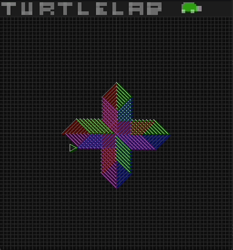
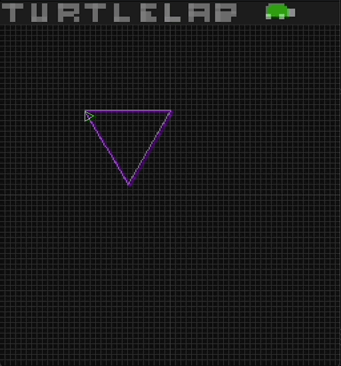

# TurtleLab
TurtleLab is a lofi audio-visual programming toy that can be scripted in multiple real-world languages. 

Supported Languages:
- Scheme
- JavaScript
- Lua




## Turtle Graphics: A Visual Programming Tool

"Turtle graphics" is a programming concept that uses a virtual turtle to create drawings or shapes on a screen. The turtle can be controlled by simple commands like "forward," "rotate," "right," and "left," which move the turtle in specific directions.

### Key Concepts:

- Turtle: A virtual object that can be moved around a coordinate system.
- Commands: Instructions that control the turtle's movements and actions, such as drawing lines, changing colors, or picking up/putting down the pen.
- Coordinate System: A grid-like system that defines the turtle's position and orientation.
- Canvas: The drawing surface where the turtle's movements and creations are displayed.

### Why are Turtle Graphics Cool?

- Visual Learning: Turtle graphics provides a visual representation of programming concepts, making it easier to understand.
- Interactive Programming: Students can experiment with different commands and see the immediate results, fostering creativity and problem-solving skills.
- Foundation for Advanced Concepts: Turtle graphics can be used as a foundation for learning more complex programming topics like loops, functions, and object-oriented programming.

# Usage
## CLI
The primary way of interacting with TurtleLab is via the CLI. 
```
Usage: turtle <file> [options]
Options:
  -l, --lang <scm|js|lua>  Specify the lang - Overrides auto detection
  -d, --delay <delay>      Specify the delay between ticks
  -s, --skipIntro          Skip the intro
  -t, --hideTurtle         Hide the cursor
  -o, --noLoop             Do not loop the program
  -a, --autoClose          Automatically close the program when done
  -b, --noDebug            Do not show debug messages
  -g, --noGrid             Do not show the grid
  -v, --volume <volume>    Set the volume
  -m, --mute               Mute the sound
  -h, --help               Display this help message
```
### Example:
```sh
./turtle examples/api.js -d 1000 -s
```

## Window Hotkeys
While the TurtleLab window is running, the following hotkeys are available:
- **SPACE**       - Pause the turtle
- **UP ARROW**    - Speed up the turtle
- **DOWN ARROW**  - Slow down the turtle
- **LEFT ARROW**  - Move forward one command
- **RIGHT ARROW** - Move backwards one command 
- **M KEY**       - Mute the audio
- **ESCAPE**      - Quit TurtleLab

# Scripting
## JavaScript ([`examples/api.js`](examples/api.js))
```js
function main() { 
    bg(22,33,44);
    color(255,255,255);
    teleport(128,64);
    down(64);
    right(64);
    up(64);
    left(64);
    downRight(64);
    downLeft(64);
    upLeft(64);
    upRight(64);
    goBack(7);
    rotateCW(64);
    rotateCCW(32);
    rotate(0);
    forward(32);
    print("Hello, world!");
}
```

## Scheme ([`examples/api.scm`](examples/api.scm))
```c
(bg 22 33 44)
(color 255 255 255)
(teleport 128 64)
(down 64)
(right 64)
(up 64)
(left 64)
(down-right 64)
(down-left 64)
(up-left 64)
(up-right 64)
(go-back 7)
(rotate-cw 64)
(rotate-ccw 32)
(rotate 0)
(forward 32)
(print "Hello, world!")
```

## Lua ([`examples/api.lua`](examples/api.lua))
```lua
bg(22, 33, 44)
color(255, 255, 255)
teleport(128, 64)
down(64)
right(64)
up(64)
left(64)
downRight(64)
downLeft(64)
upLeft(64)
upRight(64)
goBack(7)
rotateCW(64)
rotateCCW(32)
rotate(0)
forward(32)
print("Hello, world!")
```

# Script File Metadata
Scripts can contain metadata in their comments. Some meta data is functional and can change the way the program runs. All metadata is optional. 

- **`NAME:`** - Sets script name in window title
- **`OPT:`** - Set default CLI options for this file
- **`DESC:`** - A short description of the script.
- **`AUTH:`** - The name and/or contact info of the author.

### Example:
```
// NAME: My Script
// OPT: -d 100 -s
// DESC: A test script. Runs with 100ms delay and skips startup.
// AUTH: Leonardo
```

# API Details
### `bg r g b`
Set the background color. Acceptable color values are between 0 and 255.

### `color r g b a?`
Set the drawing color. Acceptable color values are between 0 and 255. Alpha is optional. 

### `forward n`
Move the turtle forward `n` pixels in the direction it is facing. Direction is determined by the current rotation value. 

### `rotate n`
Rotate the turtle to an absolute rotation value. 256 "rotation units" makes up a full rotation.

### `rotate_cw n`
Rotate the turtle clockwise `n` "rotation units". 256 "rotation units" makes up a full rotation.  

### `rotate_ccw n`
Rotate the turtle counter-clockwise `n` "rotation units". 256 "rotation units" makes up a full rotation.  

### `up n`
Move the turtle up on the Y axis `n` pixels.

### `down n`
Move the turtle down on the Y axis `n` pixels.

### `left n`
Move the turtle left on the Y axis `n` pixels.

### `right n`
Move the turtle right on the Y axis `n` pixels.

### `down_right n`
Move the turtle down and right `n` pixels in each direction. 

### `down_left n`
Move the turtle down and left `n` pixels in each direction. 

### `up_right n`
Move the turtle up and right `n` pixels in each direction. 

### `up_left n`
Move the turtle up and left `n` pixels in each direction. 

### `teleport x y`
Move to the given coordinates.

### `go_back n`
Move the turtle to where it was `n` commands ago. Does not reset the rotation. 

# Tips
- The canvas for drawing on is 256x256 px.
- Drawing outside of the canvas is generally allowed.
- `rotate 0` resets the rotation and snaps the turtle sub-position.
- Set a color with an alpha value of 0 to move without drawing.  
- The audio synthesis parameters are fed by the turtle coordinates as well as the drawing color. 
- Each subsequent command requires re-running the whole program. So very long program will slow down as they go.
- Frame delay is displayed in the window title bar. Higher numbers mean your program is running slower. 

---
---

# Build
Install the deps listed below and then run the Makefile or build with the shell scripts.
## macOS build
Deps;
```sh
brew install sdl2 --build-from-source
```
Build scripts:
```sh
./buildLibs.sh
./buildMac.sh
```

Makefile:
```sh
make turtle_mac
```

## Linux build
Deps:
```sh
sudo apt-get update
sudo apt-get install build-essential libsdl2-dev libxdamage-dev libxcomposite-dev libglew-dev
```

If you run into issues installing packages try:
```sh
sudo apt-get remove --purge libegl-mesa0
sudo apt-get clean
sudo apt-get autoremove
```

Build Scripts:
```sh
./buildLibs.sh
./buildLinux.sh
```

Makefile:
```
make turtle_linux
```